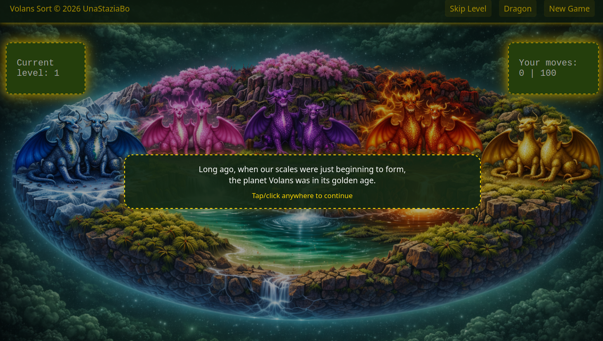
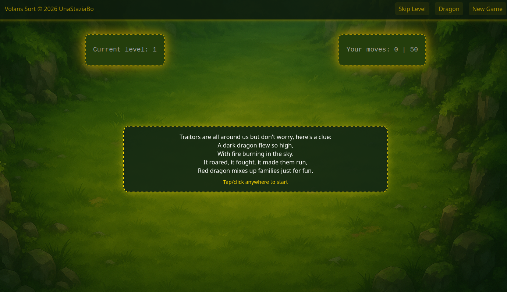
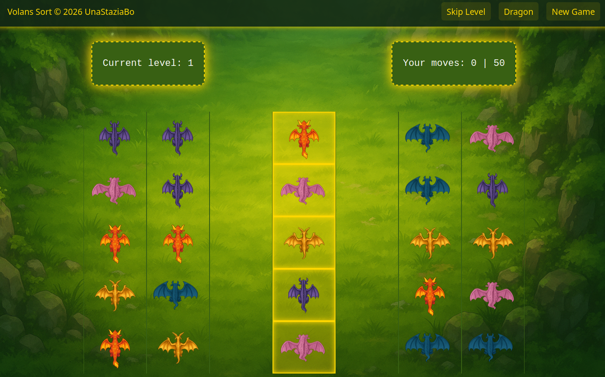
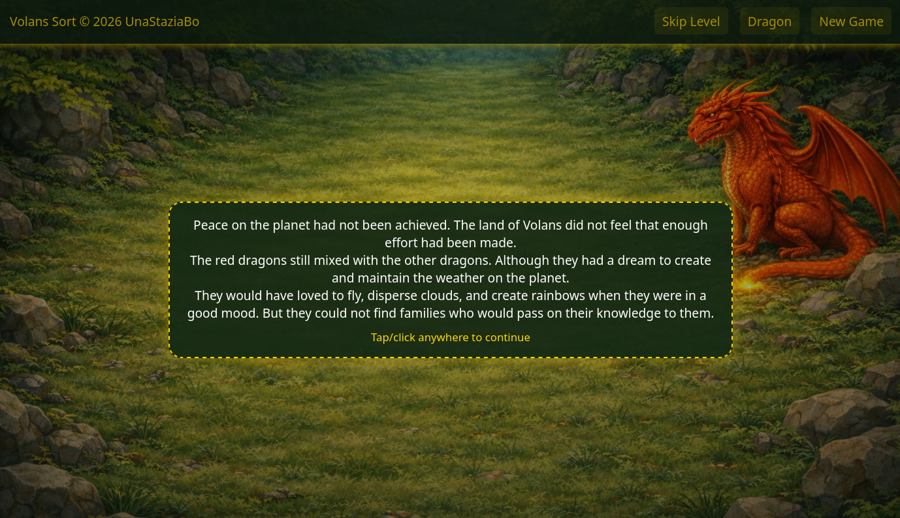
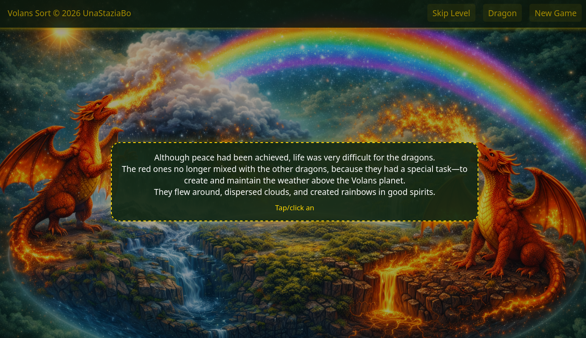

# Volans Sort Puzzle Game
#### Volans - dragon sort puzzle game with unique characters. Find your favorite (or unloved) dragon and collect them all. A well-known game now with a new story and new strategic thinking.

## Description
Long ago, when dragons first began to appear,
the planet Volans was experiencing its golden age.
But at one moment, the dragons quarreled and their families were divided in the fighting.
Help them. Their future is in your hands! 

## How to play?
    1. Pick a column to pick up the top dragon
    2. Pick another column if it matches or the column is empty.
    3. Only one dragon can be moved at a time.
    4. A column must have space for the dragon to be placed.
    5. Sort all dragon by sight to win!

Solve the secrets hidden in the poetry. The fate of the dragons depends on your results, so collect as many points as possible.

**The game has several endings. Try to see them all.**

## Features

  * Puzzle-based gameplay
  * Multiple dragon types with unique behavior
  * Narrative-driven progression
  * Atmospheric orchestral soundtrack
  * Visual story that will leave you spellbound
  * Multiple endings based on player performance

## Screenshots

### Read a unique story and help a family reunite

### Solve mysteries that will help you find your way 

### Collect all the dragons together

### Will you leave the dragon alone?

### Or you can make him happier and help him find himself and his recognition?

## Project Versions

This repository contains two implementations of the same game:

### 1) Web version (JavaScript)
- Frontend gameplay + UI (HTML/CSS/JS)
- Runs in browser (itch.io), planned mobile packaging later

### 2) Java version (Spring Boot)
- Server-side implementation of the game domain and persistence
- Includes REST controllers, service layer, entities, and JPA repositories
- Features: user management, scoring, ratings, comments, game state handling

## Tech Stack
### Web version
* Language: JavaScript
* Rendering: HTML5 Canvas / DOM
* Audio: Web Audio / HTML5 Audio
* Platform: Web (itch.io), planned Android release

### Java version
* REST API controllers for users and game-related interactions
* Service layer containing business logic
* JPA-based persistence for storing users, scores, ratings, and comments
* Custom domain exceptions for validation and rule enforcement
* Game domain module (dragons) encapsulating core gameplay concepts such as:
   1. characters
   2. levels
   3. rules
   4. shared core logic

## Play the Game
* itch.io:
* Google Play: (planned)

## License

### Code

This project’s source code is licensed under the Apache License 2.0.
See the LICENSE file for details.

### Assets
Visual and audio assets are licensed separately.
Please see CREDITS.md for detailed information about asset usage and attribution.

## Contributions
This project is currently a personal indie game project.

* Bug reports and suggestions are welcome
* Pull requests may be reviewed on a case-by-case basis

## Author
Created by UnaStaziaBo © 2026